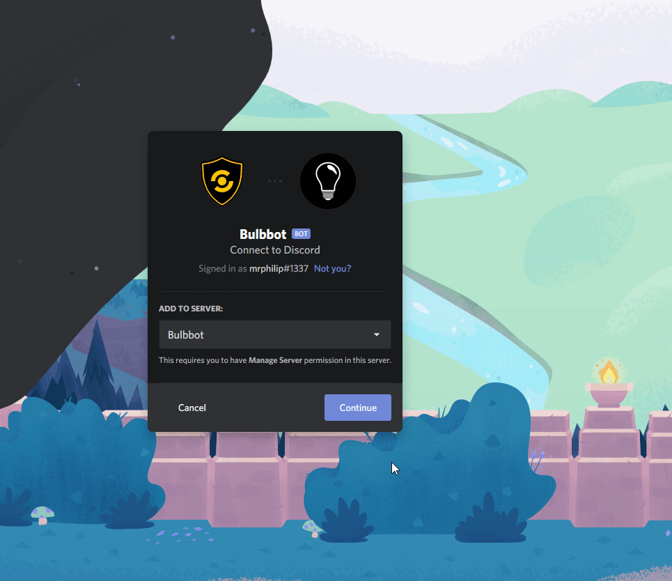
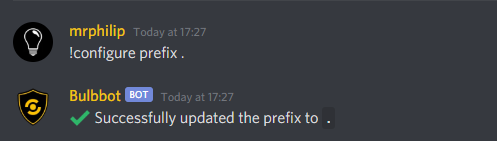
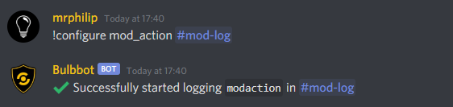
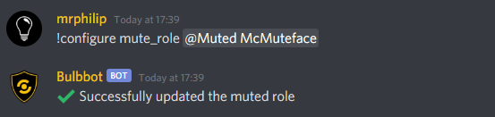

# Quick Start
This guide will take you from the start to having Bulbbot running in your server

### 1. Invite the bot to your server
Add the bot to your server with [this direct link](https://bulbbot.mrphilip.xyz/invite)

### 2. Configure default settings
#### Prefix
To change the prefix of the bot run the following command:
``!configure prefix <prefix>``

#### Logs
To set up logging for the bot in your server run the following command:
``!configure <part> <channel>``

Where the part is:
``mod_action`` - this is the channel where all of the moderation actions will be logged
``automod`` - where the bot will post its automod catches
``messagelogs`` - any message log updates (edits, message deletes)
``rolelogs`` - updates happening to the roles
``memberlogs`` - member updates inside of the server (nickname changes, receiving or having a role removed)
``channelogs`` - updates happening to channels
``joinleavelogs`` - users joining or leaving the server

#### The muted role
To change the mute role (which is needed for the mute command to work), run the following command:
``!configure mute_role <role>``

### 3. Clearance Levels
See the detailed guide written [here](./Clearance101.md)

### Additional Help
If you need any additional help, [join our support server](https://bulbbot.mrphilip.xyz/discord)